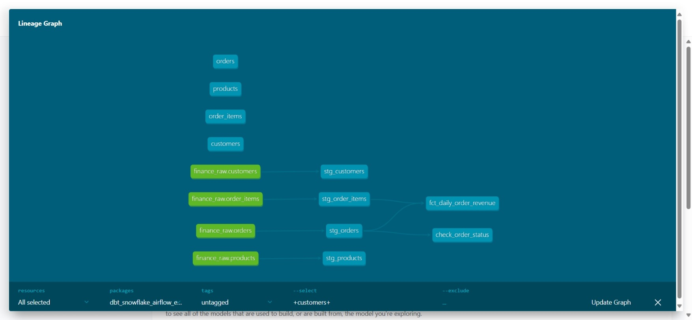
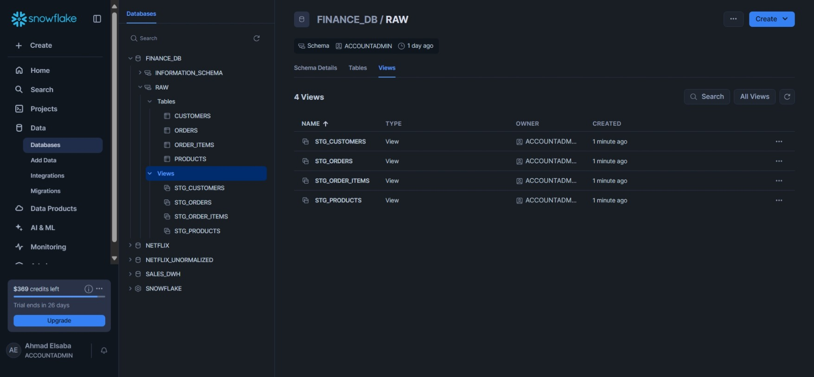

# Snowflake + dbt + Airflow ETL Pipeline

This project demonstrates a modern data engineering pipeline using dbt for transformations, Snowflake as the data warehouse, and Apache Airflow for orchestration.

## Architecture


```
Raw Data (Seeds) → Staging Layer → Analytics Layer (Marts)
     ↓                ↓               ↓
   CSV Files    →  Clean/Transform  →  Dimensions & Facts
                      ↓
               Airflow Orchestration
```

## Features

- **End-to-End Pipeline**: From raw data to analytics models
- **Modern dbt Practices**: Staging and marts layers with proper modeling
- **Docker-based Airflow**: Easy deployment with containerization
- **Full Orchestration**: Automated data pipeline with dependencies

## Data Models

### Raw Data (Seeds)
- `customers.csv` - Customer records
- `orders.csv` - Order records  
- `order_items.csv` - Order item records
- `products.csv` - Product records

### Staging Layer
- `stg_customers` - Cleaned customer data with `customer_id` PK
- `stg_products` - Product catalog with `product_id` PK
- `stg_orders` - Order data with `order_id` PK and FK to customers
- `stg_order_items` - Order line items with `item_id` PK and FKs to orders/products

### Analytics Layer (Marts)
- `dim_customers` - Customer dimension with segmentation
- `dim_products` - Product dimension with metrics
- `fct_daily_order_revenue` - Daily revenue fact table

## Technology Stack

- **dbt Core**: Data transformation and modeling
  
- **Snowflake**: Cloud data warehouse
  
- **Apache Airflow**: Workflow orchestration
- **Docker**: Containerization

## Setup

### Prerequisites
- Snowflake account
- Docker and Docker Compose
- Git

### Quick Start

1. Clone this repository:
```bash
git clone https://github.com/yourusername/snowflake-dbt-airflow-pipeline.git
cd snowflake-dbt-airflow-pipeline
```

2. Configure Snowflake credentials:
```bash
cp snowflake_env.sh.example snowflake_env.sh
# Edit snowflake_env.sh with your credentials
source snowflake_env.sh
```

3. Create the `.dbt/profiles.yml` file:
```bash
mkdir -p .dbt
cp profiles_template.yml .dbt/profiles.yml
# Edit .dbt/profiles.yml with your credentials
```

4. Start Airflow:
```bash
./start_airflow.sh
```

5. Access the Airflow UI at http://localhost:8080 (username: airflow, password: airflow)

6. Trigger the DAG named `advanced_dbt_snowflake_pipeline`

## Common Issues and Solutions

1. **Schema Name Mismatch**:
   - **Issue**: dbt seed creates tables with a schema prefix (e.g., RAW_RAW.customers) but models try to reference them with a different schema (e.g., RAW.customers)
   - **Solution**: Make sure schema names match in `schema.yml`, `profiles.yml`, and `dbt_project.yml`

2. **Docker Permission Issues**:
   - **Issue**: Airflow container might not have proper permissions to access files
   - **Solution**: Ensure proper volume mounts and file permissions

3. **dbt Version Compatibility**:
   - **Issue**: Using `config-version: 1` in newer dbt versions causes errors
   - **Solution**: Update `dbt_project.yml` to use `config-version: 2`

4. **Git in Docker**:
   - **Issue**: dbt requires git to be installed in the container
   - **Solution**: Add git to the Dockerfile

5. **Airflow Task Stuck in "up_for_retry"**:
   - **Issue**: DAG runs can get stuck if there are errors
   - **Solution**: Restart Airflow container or clear the task instances

## Project Structure

```
airflow-docker/           # Airflow configuration and DAGs
  ├── dags/               # Airflow DAG definitions
  └── docker-compose.yaml # Docker configuration for Airflow
models/                   # dbt models
  └── example/            # Example project models
    ├── schema.yml        # Source and model definitions
    ├── Staging/          # Staging models
    └── marts/            # Marts models
seeds/                    # Raw CSV data files
.dbt/                     # dbt configuration
  └── profiles.yml        # dbt connection profiles
```

## License

This project is licensed under the MIT License - see the LICENSE file for details.
