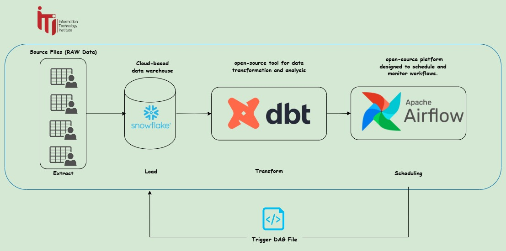

# dbt + Snowflake + Airflow ETL Pipeline

A complete modern data engineering pipeline that demonstrates advanced ETL practices using dbt, Snowflake, and Apache Airflow with automated orchestration.



## 🏗️ Architecture

```
Raw Data (Seeds) → Staging Layer → Analytics Layer (Marts)
     ↓                ↓               ↓
   CSV Files    →  Clean/Transform  →  Dimensions & Facts
                      ↓
               Airflow Orchestration
```

## 🚀 Features

### ✅ Data Pipeline
- **4 Staging Models** with primary/foreign key constraints
- **3 Analytics Models** (2 dimensions, 1 fact table)
- **Automated Orchestration** via Airflow DAGs

### ✅ Database Design
- **Proper ID Naming**: `customer_id`, `product_id`, `order_id`, `item_id`
- **Referential Integrity**: Primary keys and foreign key relationships
- **Schema Separation**: Raw data in `DBT_DEV_RAW_RAW`, processed data in `DBT_DEV_RAW`

## 📊 Data Models

### Raw Data (Seeds)
- `customers.csv` - 100 customer records
- `orders.csv` - 300 order records  
- `order_items.csv` - 600 order item records
- `products.csv` - 10 product records

### Staging Layer
- `stg_customers` - Cleaned customer data with `customer_id` PK
- `stg_products` - Product catalog with `product_id` PK
- `stg_orders` - Order data with `order_id` PK and FK to customers
- `stg_order_items` - Order line items with `item_id` PK and FKs to orders/products

### Analytics Layer (Marts)
- `dim_customers` - Customer dimension with segmentation (VIP, Regular, New)
- `dim_products` - Product dimension with performance metrics
- `fct_daily_order_revenue` - Daily revenue fact table with order analytics

## 🛠️ Technology Stack

- **🔄 dbt (1.9.0)** - Data transformation and modeling
- **❄️ Snowflake** - Cloud data warehouse
- **🌬️ Apache Airflow (2.10.3)** - Workflow orchestration
- **🐍 Python (3.11)** - Runtime environment

## 🚀 Quick Start

### 1. Prerequisites
- Snowflake account with ACCOUNTADMIN access
- Python 3.11+
- Git

### 2. Setup

```bash
# Clone the repository
git clone https://github.com/ahmadelsap3/dbt-snowflake-airflow-etl-pipeline.git
cd dbt-snowflake-airflow-etl-pipeline
```

#### Platform-Specific Setup

We provide setup scripts for different platforms in the `setup` directory:

- **Linux/Mac**: Use the setup script in `setup/linux/`
- **Windows**: Use the setup script in `setup/windows/`
- **GitHub Codespaces**: Use the setup script in `setup/codespaces/`

For detailed instructions, see the README.md in each platform directory.

### 3. Configure Snowflake Connection

**Step 1: Environment Variables**
Update the environment variables file for your platform:

- **Linux/Mac**: Edit `snowflake_env.sh` 
- **Windows**: Edit `snowflake_env.ps1`

Example (Linux/Mac):
```bash
export SNOWFLAKE_USER="your_username"
export SNOWFLAKE_PASSWORD="your_password" 
export SNOWFLAKE_ACCOUNT="your_account_identifier"
export SNOWFLAKE_WAREHOUSE="your_warehouse"
export SNOWFLAKE_DATABASE="your_database"
```

**Step 2: dbt Profile**
Copy and configure the dbt profile:

```bash
# Copy the template
cp profiles_template.yml ~/.dbt/profiles.yml  # Linux/Mac
# Or on Windows
copy profiles_template.yml %USERPROFILE%\.dbt\profiles.yml

# Edit with your Snowflake credentials
nano ~/.dbt/profiles.yml  # Linux/Mac
# Or on Windows
notepad %USERPROFILE%\.dbt\profiles.yml
```

Update the profile with your actual Snowflake connection details:

```yaml
dbt_snowflake_airflow_etl_pipeline:
  outputs:
    dev:
      account: YOUR_SNOWFLAKE_ACCOUNT  # e.g., xy12345.us-east-1
      database: YOUR_DATABASE_NAME    # e.g., finance_db
      role: ACCOUNTADMIN
      schema: YOUR_SCHEMA_NAME       # e.g., raw
      threads: 4
      type: snowflake
      user: YOUR_SNOWFLAKE_USERNAME
      warehouse: YOUR_WAREHOUSE_NAME # e.g., compute_wh
      password: "YOUR_SNOWFLAKE_PASSWORD"
  target: dev
```

**Step 3: Test Connection**

```bash
# Test dbt connection (Linux/Mac)
source .venv/bin/activate
source snowflake_env.sh
dbt debug --profiles-dir .

# Test dbt connection (Windows)
.\.venv\Scripts\activate.ps1
. .\snowflake_env.ps1
dbt debug --profiles-dir .
```

### 4. Start Services

For detailed setup instructions by platform, see the README files in the `setup` directory.

```bash
# Start Airflow on Linux/Mac
./start_airflow.sh

# Start Airflow on Windows
.\start_airflow.bat

# Access Airflow UI at http://localhost:8080
# Username: admin, Password: admin
```

## 🎯 Pipeline Execution

### Manual Execution

```bash
# Load raw data
dbt seed --profiles-dir .

# Run staging transformations  
dbt run --select example.Staging --profiles-dir .

# Run analytics transformations
dbt run --select example.marts --profiles-dir .
```

### Automated Execution via Airflow

1. Access Airflow UI at http://localhost:8080
2. Navigate to DAG: `advanced_dbt_snowflake_pipeline`
3. Toggle DAG to "ON"
4. Click "Trigger DAG" to execute

## 📈 Pipeline Stages

### Stage 1: Data Ingestion (`dbt_seed`)
- Loads CSV files into Snowflake raw schema
- 1,010 total records across 4 tables

### Stage 2: Data Transformation (`dbt_run_staging`) 
- Creates 4 staging tables with clean, standardized data
- Applies data typing, filtering, and business rules
- Implements primary/foreign key constraints

### Stage 3: Analytics Layer (`dbt_run_marts`)
- Builds 2 dimension tables and 1 fact table
- Customer segmentation and product performance metrics
- Daily order revenue aggregations

## 📁 Project Structure

```
├── dbt_project.yml          # dbt configuration
├── profiles_template.yml    # Database connection template
├── snowflake_env.sh         # Linux/Mac environment variables
├── snowflake_env.ps1        # Windows environment variables
├── setup.sh                 # Setup script
├── start_airflow.sh         # Airflow startup for Linux/Mac
├── start_airflow.bat        # Airflow startup for Windows
├── requirements.txt         # Python dependencies
├── dags/
│   └── advanced_dbt_snowflake_dag.py  # Airflow DAG
├── models/
│   └── example/
│       ├── schema.yml       # Data documentation
│       ├── Staging/         # Staging models
│       │   ├── stg_customers.sql
│       │   ├── stg_products.sql  
│       │   ├── stg_orders.sql
│       │   └── stg_order_items.sql
│       └── marts/           # Analytics models
│           ├── dim_customers.sql
│           ├── dim_products.sql
│           └── fct_daily_order_revenue.sql
├── seeds/                   # Raw CSV data
├── analyses/                # Ad-hoc queries
└── screenshots/             # Documentation images
```

## 🧪 Running Models

### Run All Models

```bash
dbt run --profiles-dir .
```

### Run Specific Models

```bash
dbt run --select stg_customers --profiles-dir .
```

### Run Model Layers

```bash
dbt run --select example.Staging --profiles-dir .
```

## 🔧 Configuration

### dbt Profiles (`profiles.yml`)
- Environment-based configuration
- Secure credential management via environment variables

### Airflow Configuration
- Sequential executor for development
- SQLite metadata database
- 5-minute retry delays

## 🔧 Troubleshooting

### Common Issues

#### 1. Profile not found

If you see "Could not find profile named 'dbt_snowflake_airflow_etl_pipeline'":

```bash
# Configure dbt profile
cp profiles_template.yml ~/.dbt/profiles.yml  # Linux/Mac
# Or on Windows
copy profiles_template.yml %USERPROFILE%\.dbt\profiles.yml

# Edit the profile with your Snowflake credentials
# Then test connection
dbt debug --profiles-dir .
```

#### 2. Snowflake authentication errors

If you see "Connection failed" or Snowflake authentication errors:

```bash
# Check your credentials in both files:
nano snowflake_env.sh      # Linux/Mac
# Or on Windows
notepad snowflake_env.ps1

# Test connection
source snowflake_env.sh    # Linux/Mac
# Or on Windows
. .\snowflake_env.ps1
dbt debug --profiles-dir .
```

#### 3. Schema or permission errors

Ensure your Snowflake user has proper permissions:

- CREATE SCHEMA on database
- CREATE TABLE on schemas
- SELECT/INSERT/UPDATE/DELETE on tables

#### 4. Airflow DAG not appearing

```bash
# Check DAG syntax
python dags/advanced_dbt_snowflake_dag.py

# Restart Airflow services
./start_airflow.sh  # Linux/Mac
# Or on Windows
.\start_airflow.bat
```

### Debug Commands

```bash
# Run dbt models individually
dbt run --models stg_customers

# Check Airflow configuration
airflow config list

# View detailed logs
tail -f airflow_home/logs/scheduler/latest  # Linux/Mac
# Or on Windows
Get-Content -Tail 20 -Wait airflow_home\logs\scheduler\latest
```

## 🏆 Best Practices Implemented

### Data Engineering

- ✅ Schema separation (raw → staging → marts)
- ✅ Proper naming conventions
- ✅ Incremental processing capabilities
- ✅ Data lineage documentation

## 🔄 Continuous Integration

The pipeline supports automated execution with:

- Scheduled DAG runs (daily)
- Manual trigger capability
- Error handling and retries
- Comprehensive logging

## 🤝 Contributing

1. Fork the repository
2. Create a feature branch
3. Make your changes
4. Run models: `dbt run --profiles-dir .`
5. Submit a pull request

---

### Built with ❤️ for modern data engineering
